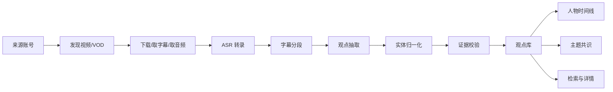

# 财经观点雷达（Finance Opinion Radar）产品需求文档 PRD

> 文档状态：V1.0  
> 产品形态：独立产品、独立代码仓、独立数据库、独立部署  
> 本文档范围：产品需求、信息架构、原型设计、数据与接口需求、非功能需求、验收标准  
> **明确约束：本产品不得并入 DreamOAgents / 其他量化系统，不共享数据库、不共享任务队列、不引用对方内部代码。未来如需互通，只允许通过稳定版本化 API / Webhook。**

---

## 1. 产品定义

### 1.1 一句话定义

财经观点雷达是一套面向财经内容研究场景的“公开视频/直播采集 → 语音转录 → 观点抽取 → 证据绑定 → 历史观点变化 → 多人物共识/分歧”的独立情报产品。

它不是普通“视频摘要工具”。  
产品核心对象不是 `summary`，而是可追溯、可比较、可聚合的 **Viewpoint（观点）**。

### 1.2 核心价值

用户真正需要回答的问题：

1. 今天这些财经主播、博主、研究者分别在看多/看空什么？
2. 谁的观点发生了变化？
3. 某一主题当前的市场共识是什么？
4. 共识是在增强还是减弱？
5. 一条 AI 抽取的观点，原视频里到底说了什么？
6. 这个观点来自哪一期视频、哪个时间点、哪个说话人？
7. 同一个人过去 7 天、30 天对同一主题的观点如何演化？
8. AI 是否把重复观点、模糊表态、引用他人观点误判为本人观点？

### 1.3 V1 产品目标

V1 必须完整跑通：



V1 默认先做 VOD，直播自动值守列为 V1.5；原因是先验证“观点识别和证据链”是否可靠，再扩大采集复杂度。

---

## 2. 产品边界

### 2.1 V1 必做

- 来源人物管理
- 来源频道/账号管理
- VOD 自动发现
- 手工提交公开视频 URL
- 媒体元数据抓取
- 字幕优先、ASR 兜底
- faster-whisper 转录
- 可选 WhisperX 词级对齐
- 5～10 分钟逻辑分块
- LLM 观点抽取
- 观点去重
- 标的/行业/宏观主题归一化
- 观点方向：强看多 / 看多 / 中性 / 看空 / 强看空 / 无明确方向
- 时间周期：日内 / 1-3D / 1-4W / 1-3M / 3M+
- Evidence 证据绑定
- 人物观点时间线
- 主题共识
- 观点变化检测
- 低置信度人工复核
- 全链路任务状态
- 模型、Prompt、规则版本留痕
- 搜索、过滤、导出

### 2.2 V1 不做

- 自动交易
- 投资建议
- 私域/付费内容绕过权限采集
- 自动破解平台反爬或验证码
- 账号接管
- 直播弹幕情绪
- 全网舆情爬虫
- 自动发布内容
- 与其他产品共享 DB
- 与其他产品共用登录态
- 将摘要直接当“观点”

### 2.3 后续可扩展

- 抖音/B站/YouTube 直播值守
- X / Podcast / RSS
- 实时转录
- 观点事件预警
- 主播准确率/一致性研究
- 观点与市场价格事后验证
- 企业团队协作
- 外部 API

---

## 3. 目标用户与角色

### 3.1 研究用户

需要批量跟踪财经内容源，核心动作：查“谁说了什么”和“是否变了”。

### 3.2 内容研究员

需要从大量视频中快速找观点，并回到原视频证据。

### 3.3 管理员

维护来源、模型、Prompt、采集任务、异常任务和系统资源。

### 3.4 权限角色

| 角色 | 权限 |
|---|---|
| Admin | 全部功能、来源配置、模型配置、任务重跑 |
| Analyst | 查看、检索、复核、编辑观点标签 |
| Viewer | 只读 |

V1 可先用单租户 + RBAC，不做复杂多租户。

---

## 4. 核心业务规则

### 4.1 Evidence First

任何进入正式观点库的观点必须满足：

- 绑定 `source_item_id`
- 绑定至少一个 `transcript_segment_id`
- 有 `start_ms` 和 `end_ms`
- 保存原始文字证据
- 保存抽取模型版本
- 保存 Prompt 版本
- 保存结构化结果原文
- 保存置信度
- 可从前端一键跳回证据时间

缺少证据的模型输出只能进入 `candidate_viewpoint`，不得展示为正式观点。

### 4.2 观点与摘要严格分离

一个视频可以有一份 Summary，但一份 Summary 不等于观点。

观点必须是“某个明确说话主体针对某个实体/主题表达的判断、倾向、预期或条件性结论”。

以下内容默认不算观点：

- 主持人口播广告
- 纯事实播报
- 引用别人的观点但本人未表态
- 模糊寒暄
- 无法识别对象的“我觉得还行”
- 单纯复述历史价格

### 4.3 观点方向枚举

```text
strong_bullish
bullish
neutral
bearish
strong_bearish
unclear
```

### 4.4 观点变化枚举

```text
new_thesis
strengthening
weakening
stance_flip
horizon_change
repeated
expired
unclear
```

### 4.5 观点合并

同人物、同主题、同一 source_item 内：

- 语义高度相同 → 合并为一条，保留多个 evidence
- 明确相反 → 分成两条，并标记“同源内观点冲突”
- 一个是短期、一个是长期 → 不合并
- 一个是条件性，一个是明确判断 → 不合并

---

## 5. 来源与开源组件方案

### 5.1 推荐组件

| 能力 | 推荐 | 使用策略 |
|---|---|---|
| 多平台 VOD 下载 | yt-dlp | Adapter 调用，不把其业务逻辑写进核心域 |
| 直播值守 | DouyinLiveRecorder / StreamCap | V1.5；优先独立进程/服务调用 |
| ASR | faster-whisper | 默认 ASR Provider |
| 精细时间戳/说话人 | WhisperX | 可选增强 Provider |
| 视频处理 | FFmpeg | 系统依赖，单独管理 |
| 工作流 | Celery/Redis | V1 默认；无需一开始引入 Agent 框架 |
| Agent 图 | LangGraph | 只有当 Review/Retry 状态复杂后再引入 |
| 字幕流水线参考 | VideoLingo | 只参考架构与工程处理，不 Fork 为产品底座 |

### 5.2 已核对的开源注意点

- `ihmily/DouyinLiveRecorder` 项目元数据标注 MIT；如二次分发其打包二进制，应额外审查 FFmpeg/第三方组件许可证。
- `ihmily/StreamCap` 为 Apache-2.0。
- `SYSTRAN/faster-whisper` 为 MIT。
- `m-bain/whisperX` 为 BSD-2-Clause；其 diarization 还会牵涉 pyannote 模型条款。
- `yt-dlp` 源码/部分发行形式为 Unlicense，但不同打包方式可能携带不同第三方许可证；产品建议通过受控依赖安装，不把未知打包二进制直接嵌入商业发行包。
- `Huanshere/VideoLingo` 为 Apache-2.0，可用于流程设计参考。
- `langchain-ai/langgraph` 为 MIT。

### 5.3 Adapter 原则

核心域禁止出现平台 SDK 细节：

```python
class MediaSourceAdapter(Protocol):
    def discover(self, source_account) -> list[DiscoveredItem]: ...
    def resolve(self, url: str) -> ResolvedMedia: ...
    def fetch_subtitle(self, item) -> SubtitleResult | None: ...
    def download_media(self, item) -> DownloadResult: ...
```

实现：

- `YoutubeAdapter`
- `BilibiliAdapter`
- `DouyinAdapter`
- `GenericYtDlpAdapter`

未来平台失效时，只替换 Adapter。

---

## 6. 信息架构

```text
财经观点雷达
├── 总览
├── 今日观点
├── 人物雷达
│   ├── 人物列表
│   └── 人物详情
├── 主题雷达
│   ├── 主题列表
│   └── 主题详情
├── 来源中心
│   ├── 来源人物
│   ├── 频道/账号
│   └── 视频/直播记录
├── 观点复核
├── 任务中心
└── 系统设置
    ├── 模型
    ├── Prompt
    ├── 实体词典
    └── 采集设置
```

---

# 7. 原型设计

## 7.1 全局设计规范

### 布局

- Desktop First，1440px 设计基准
- 左侧导航 220px
- 顶部状态栏 56px
- 内容区最大宽度 1600px
- 12 列栅格
- 表格密度中高
- 不使用大面积营销型 Hero

### 视觉

- 风格：研究终端 / Intelligence Terminal
- 主要颜色只负责状态，不把上涨下跌全部靠颜色表达
- 所有 Bullish/Bearish 状态必须同时带图标/文本
- 重要数字用等宽数字
- 证据时间戳采用可点击 Chip

---

## 7.2 页面 P01：总览 Dashboard

### 目标

30 秒内回答：今天系统采了多少内容、产生多少有效观点、哪些主题变化最大、谁的观点变化最大、有没有失败任务。

### 线框

```text
┌────────────────────────────────────────────────────────────────────┐
│ 财经观点雷达                            [日期] [搜索] [任务状态]    │
├──────────────┬─────────────────────────────────────────────────────┤
│ 左侧导航     │ 今日采集  18   有效观点 126   待复核 12   异常 2   │
│              ├─────────────────────────────────────────────────────┤
│ 总览         │ 主题共识变化 TOP 5         人物观点变化 TOP 5       │
│ 今日观点     │ ┌───────────────────┐      ┌────────────────────┐   │
│ 人物雷达     │ │ AI算力 +18.6%     │      │ A 中性→看多        │   │
│ 主题雷达     │ │ 黄金   -12.2%     │      │ B 看多→中性        │   │
│ 来源中心     │ └───────────────────┘      └────────────────────┘   │
│ 观点复核     ├─────────────────────────────────────────────────────┤
│ 任务中心     │ 最近观点流                                              │
│ 设置         │ 人物 | 主题 | 方向 | 变化 | Evidence | 来源 | 时间     │
└──────────────┴─────────────────────────────────────────────────────┘
```

### 组件

- KPI Card ×4
- `ConsensusDeltaTable`
- `CreatorChangeTable`
- `RecentViewpointTable`
- `PipelineHealthMini`
- 全局日期过滤器

### 空状态

“当前日期无已完成分析内容”，提供：
- 添加来源
- 手工提交 URL

---

## 7.3 页面 P02：今日观点

### 表格字段

| 字段 | 说明 |
|---|---|
| 时间 | 来源发布时间 |
| 人物 | creator |
| 主题 | canonical topic |
| 标的 | entity |
| 观点 | claim |
| 方向 | stance |
| 周期 | horizon |
| 变化 | change_type |
| 置信度 | confidence |
| Evidence | 时间戳按钮 |
| 状态 | auto_verified / review_required / reviewed |

### 筛选

- 日期
- 人物
- 主题
- 方向
- 周期
- 观点变化
- 置信度
- 是否待复核
- 来源平台

点击行 → 右侧 Drawer 展示完整证据。

---

## 7.4 页面 P03：观点 Evidence Drawer

```text
┌──────────────────────────────────────────────┐
│ AI算力可能进入新一轮上行阶段                 │
│ Bullish | 1-4W | Confidence 0.91             │
├──────────────────────────────────────────────┤
│ 人物：A                                      │
│ 来源：2026-xx-xx 直播复盘                     │
│                                               │
│ Evidence #1                                  │
│ [01:23:14 →]  “……”                           │
│                                               │
│ Evidence #2                                  │
│ [01:28:09 →]  “……”                           │
├──────────────────────────────────────────────┤
│ 模型判断理由                                  │
│ ...                                           │
├──────────────────────────────────────────────┤
│ [确认] [改为中性] [编辑实体] [标记误判]       │
└──────────────────────────────────────────────┘
```

点击时间戳：
- 有网页播放 URL + 时间参数 → 打开原链接
- 有本地媒体 → 打开内置播放器并 seek
- 无法 seek → 至少复制时间戳

---

## 7.5 页面 P04：人物雷达

### 人物列表

- 姓名
- 平台数
- 最近更新时间
- 30D 观点数
- 当前偏多主题数
- 当前偏空主题数
- 最近观点变化

### 人物详情

顶部：
- 人物资料
- 账号
- 最近分析时间
- 采集健康状态

中部：
- 观点时间线
- 当前主题持仓式矩阵（非真实持仓，仅观点）

```text
AI算力      强看多      1-4W     ↑ strengthening
黄金        中性        1-3M     → repeated
A股指数     看空        1-3D     ↓ stance_flip
```

底部：
- 历史视频
- 历史观点
- 证据

---

## 7.6 页面 P05：主题雷达

主题详情：

```text
主题：AI算力

监测人物：27
明确看多：16
中性：6
明确看空：5
Bullish Ratio：59.3%
7D Delta：+18.6%
Consensus Confidence：0.78
Disagreement：0.31

[7D] [30D] [90D] 共识趋势图

人物观点分布
A  看多   ↑
B  看多   →
C  看空   →
...
```

### 计算口径

V1 简单透明优先：

```text
bullish_weight =
strong_bullish 2
bullish        1
neutral        0
bearish       -1
strong_bearish -2

creator_topic_latest = 每个人对主题的最新有效观点

bullish_ratio =
看多与强看多人数 / 有明确方向人数
```

不做复杂黑箱指数。

---

## 7.7 页面 P06：来源中心

### 来源人物

字段：
- creator_id
- display_name
- alias
- enabled
- priority
- notes

### 来源账号

字段：
- platform
- handle
- url
- external_id
- discovery_mode
- poll_interval
- enabled
- last_success_at
- consecutive_failures

操作：
- 新增
- 暂停
- 立即发现
- 测试解析
- 查看最近失败

---

## 7.8 页面 P07：视频/来源详情

模块：

1. 视频元数据
2. 下载状态
3. 字幕/ASR 状态
4. 原始 Transcript
5. 分段 Transcript
6. 抽取观点
7. Pipeline Log
8. Retry

必须显示每一步耗时和错误码。

---

## 7.9 页面 P08：观点复核

适用于：

- confidence < 阈值
- stance=unclear
- 实体映射冲突
- Evidence 太短
- 模型 reviewer 与 extractor 不一致
- 同视频出现相反观点

操作：

- Confirm
- Edit
- Reject
- Merge
- Split
- Re-run extraction

审核操作必须写 audit log。

---

## 7.10 页面 P09：任务中心

任务类型：

```text
DISCOVER
RESOLVE_MEDIA
DOWNLOAD_MEDIA
FETCH_SUBTITLE
TRANSCRIBE
ALIGN
CHUNK
EXTRACT_VIEWPOINT
NORMALIZE_ENTITY
REVIEW_VIEWPOINT
BUILD_SNAPSHOT
BUILD_CONSENSUS
```

字段：
- job_id
- type
- source_item
- status
- attempt
- queued_at
- started_at
- finished_at
- worker
- error_code
- error_message

支持：
- 重跑
- 取消
- 查看上下游任务
- 复制 trace_id

---

# 8. 数据模型

## 8.1 表清单

### `creator`

```text
id bigint pk
display_name varchar(100)
bio text
avatar_url text
status varchar(20)
created_at timestamptz
updated_at timestamptz
```

### `source_account`

```text
id bigint pk
creator_id bigint fk
platform varchar(30)
external_id varchar(200)
handle varchar(200)
url text
discovery_mode varchar(30)
poll_interval_sec int
enabled boolean
last_success_at timestamptz
failure_count int
config_json jsonb
unique(platform, external_id)
```

### `source_item`

```text
id bigint pk
source_account_id bigint fk
external_item_id varchar(300)
item_type varchar(20) -- vod/live
title text
description text
published_at timestamptz
duration_ms bigint
canonical_url text
thumbnail_url text
language varchar(20)
status varchar(30)
metadata_json jsonb
unique(source_account_id, external_item_id)
```

### `media_asset`

```text
id bigint pk
source_item_id bigint fk
asset_type varchar(30) -- video/audio/subtitle
storage_uri text
mime_type varchar(100)
size_bytes bigint
sha256 char(64)
duration_ms bigint
created_at timestamptz
```

### `transcript_segment`

```text
id bigint pk
source_item_id bigint fk
speaker_label varchar(100)
start_ms bigint
end_ms bigint
text text
language varchar(20)
asr_confidence numeric(5,4)
sequence_no int
metadata_json jsonb
index(source_item_id, sequence_no)
```

### `topic`

```text
id bigint pk
canonical_name varchar(200)
topic_type varchar(30)
aliases text[]
status varchar(20)
```

### `entity`

```text
id bigint pk
entity_type varchar(30)
canonical_name varchar(200)
symbol varchar(50)
market varchar(30)
aliases text[]
metadata_json jsonb
```

### `viewpoint`

```text
id bigint pk
creator_id bigint fk
source_item_id bigint fk
topic_id bigint fk null
entity_id bigint fk null
claim text
stance varchar(30)
horizon varchar(30)
conditional boolean
importance numeric(5,4)
confidence numeric(5,4)
change_type varchar(30)
verification_status varchar(30)
extractor_version varchar(100)
prompt_version varchar(100)
created_at timestamptz
updated_at timestamptz
```

### `viewpoint_evidence`

```text
id bigint pk
viewpoint_id bigint fk
transcript_segment_id bigint fk
start_ms bigint
end_ms bigint
evidence_text text
evidence_order int
```

### `creator_topic_snapshot`

每天/每次重建：

```text
creator_id
topic_id
snapshot_date
latest_viewpoint_id
stance
horizon
confidence
change_type
primary key(creator_id, topic_id, snapshot_date)
```

### `topic_consensus_daily`

```text
topic_id
trade_date/date
creator_count
bullish_count
neutral_count
bearish_count
bullish_ratio
net_stance_score
disagreement_score
confidence
```

### `prompt_version`

保存：
- name
- version
- schema_json
- prompt_text
- enabled
- checksum

### `job_run`

任务追踪。

### `audit_log`

记录人工修改。

---

# 9. LLM 输出协议

## 9.1 Extractor 输出必须是 JSON Schema

示意：

```json
{
  "viewpoints": [
    {
      "topic": "AI算力",
      "entity": null,
      "claim": "当前调整接近尾声，未来数周偏多",
      "stance": "bullish",
      "horizon": "1-4W",
      "conditional": false,
      "importance": 0.83,
      "confidence": 0.91,
      "evidence_segment_ids": [10021, 10022],
      "reason": "说话人直接表达了后续偏多判断"
    }
  ]
}
```

### 硬规则

- 不允许模型自造 segment_id
- segment_id 必须属于当前 chunk
- evidence_text 必须可由数据库重建
- 输出不符合 Schema → 自动修复一次；仍失败 → job failed
- 同一 chunk 最大观点数 configurable
- 模型不能直接写入正式表，由服务端校验后入库

---

# 10. API 需求

统一前缀 `/api/v1`.

## 10.1 来源

```text
GET    /creators
POST   /creators
GET    /creators/{id}
PATCH  /creators/{id}

GET    /source-accounts
POST   /source-accounts
POST   /source-accounts/{id}/discover
POST   /source-accounts/{id}/test
```

## 10.2 来源内容

```text
GET  /source-items
POST /source-items/resolve-url
GET  /source-items/{id}
POST /source-items/{id}/retry
GET  /source-items/{id}/transcript
```

## 10.3 观点

```text
GET   /viewpoints
GET   /viewpoints/{id}
PATCH /viewpoints/{id}
POST  /viewpoints/{id}/confirm
POST  /viewpoints/{id}/reject
POST  /viewpoints/{id}/reextract
```

## 10.4 雷达

```text
GET /radar/creators/{id}
GET /radar/topics
GET /radar/topics/{id}
GET /radar/topics/{id}/consensus
GET /dashboard
```

## 10.5 任务

```text
GET  /jobs
GET  /jobs/{id}
POST /jobs/{id}/retry
POST /jobs/{id}/cancel
```

---

# 11. Pipeline 状态机

`source_item.status`：

```text
discovered
resolved
media_ready
transcribing
transcribed
extracting
reviewing
ready
failed
ignored
```

状态只允许按状态机迁移，不允许前端任意改字符串。

幂等键建议：

```text
DISCOVER: platform + external_item_id
TRANSCRIBE: media_sha256 + asr_provider + model_version
EXTRACT: source_item_id + transcript_revision + prompt_version + model_version
CONSENSUS: date + topic + consensus_rule_version
```

---

# 12. 非功能需求

## 12.1 可维护性

- 单独 Git 仓库
- 单独 Docker Compose / Helm
- 独立 `.env`
- 独立 DB
- 独立 Redis
- 独立对象存储 Bucket
- 独立 Sentry/日志项目
- 版本化 API
- 所有外部平台通过 Adapter

## 12.2 可观测性

必须记录：

- trace_id
- source_item_id
- job_id
- model
- token/input/output 计量
- ASR 时长
- 下载耗时
- worker
- retry_count

核心指标：

- Discover Success Rate
- Download Success Rate
- ASR Success Rate
- Extraction Schema Pass Rate
- Viewpoint Review Reject Rate
- Evidence Missing Rate
- End-to-End Ready Rate

## 12.3 安全

- API Key / Cookie 仅保存 Secret，不写数据库明文
- URL 解析防 SSRF
- 上传文件限制 MIME/大小
- 前端不直接访问对象存储私有路径
- 审计管理员修改
- 禁止将敏感 Cookie 输出日志

## 12.4 合规

- 仅处理合法可访问内容
- 不设计绕过付费墙、登录限制、验证码或访问控制
- 对转载、下载、展示原视频内容遵守来源平台条款与版权要求
- 对外展示尽量保存链接与短证据文本，不默认重新分发整段媒体
- 产品输出显著标识“AI 结构化观点，不构成投资建议”

---

# 13. V1 验收标准

## 功能验收

1. 可配置至少 10 个来源账号。
2. 能自动发现新 VOD。
3. 能手工提交一个公开视频 URL 并完成解析。
4. 有字幕时优先使用原字幕；无字幕时自动 ASR。
5. 一小时中文视频可形成带时间戳 transcript。
6. 每条正式 viewpoint 至少一个 evidence。
7. Evidence 可回到原视频时间点或内置媒体时间。
8. 同人物同主题能够展示历史时间线。
9. 能输出主题的最新看多/中性/看空人数。
10. 低置信度观点进入复核队列。
11. 人工审核可确认、编辑、拒绝。
12. 任一步失败可以从任务中心重跑。
13. 重跑不产生重复数据。
14. Prompt/Model 更新不会覆盖历史版本。
15. 所有人工更改有 audit log。

## 质量验收

建立人工标注集，不少于：

- 20 个视频
- 300 条人工观点
- 至少 5 位人物
- 至少 10 个主题

指标：

- Evidence Missing Rate = 0
- Schema Pass Rate ≥ 99%
- 明确方向观点 Stance Accuracy ≥ 90%
- Topic/Entity Normalization Accuracy ≥ 95%
- 人工抽取观点 Recall ≥ 85%
- Reviewer 后误报率明显低于单 Extractor
- 重复观点合并错误必须可人工修正

---

# 14. V1 发布门槛

必须全部满足才允许 Production：

- 数据库迁移可回滚
- Docker 一键启动
- Worker 异常自动重启
- 关键外部依赖失败有 Retry/Backoff
- 管理后台可查看全部失败任务
- 备份策略验证
- 10 个来源连续运行稳定
- 标注集通过
- 许可证清单完成
- 安全 Secret 扫描通过
- README、部署文档、运维 Runbook 齐全

---

# 15. 未来与其他产品互通原则

如果未来 Content Studio 或其他系统需要消费本产品数据：

**只提供 API：**

```text
GET /api/v1/export/viewpoints
GET /api/v1/export/topic-consensus
POST webhook viewpoint.updated
```

禁止：

- 直接连本产品 PostgreSQL
- 共用 Redis
- 共用 worker
- Git submodule 引入内部代码
- Copy 内部 ORM Model 给其他项目

这样两个产品才能独立升级、独立停机、独立扩容。
