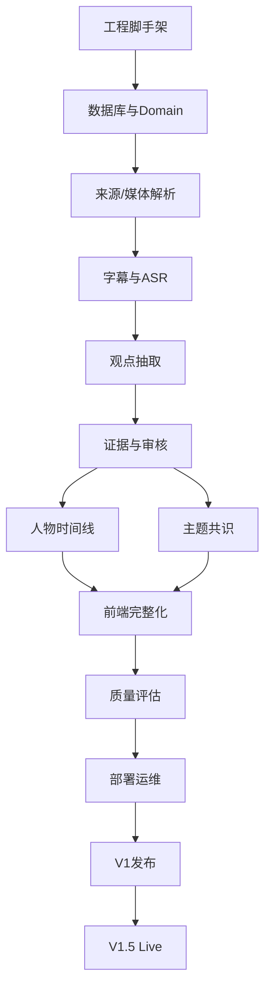

# 财经观点雷达（Finance Opinion Radar）可执行开发计划

> 文档状态：V1.0  
> 目标：开发人员可以按任务编号顺序直接实施。  
> 独立性：新建独立仓库，不接入 DreamOAgents，不共享 DB/Redis/对象存储。  
> 本计划采用“先 VOD、后 Live；先证据链、后共识；先正确、后实时”的顺序。

---

# 0. 最终技术方案

## 0.1 仓库

建议仓库名：

```text
finance-opinion-radar
```

目录：

```text
finance-opinion-radar/
├── apps/
│   ├── api/                  # FastAPI
│   ├── web/                  # React + TypeScript
│   └── worker/               # Celery worker 入口
├── packages/
│   └── contracts/            # OpenAPI 生成类型/JSON Schema
├── services/
│   ├── media/                # 下载、FFmpeg
│   ├── transcription/        # ASR provider
│   └── llm/                  # LLM provider
├── migrations/
├── tests/
│   ├── unit/
│   ├── integration/
│   ├── fixtures/
│   └── golden/
├── infra/
│   ├── docker/
│   └── compose/
├── docs/
│   ├── adr/
│   ├── api/
│   ├── prototype/
│   └── runbook/
├── scripts/
├── .env.example
├── docker-compose.yml
├── Makefile
└── README.md
```

## 0.2 技术栈

后端：

- Python 3.12
- FastAPI
- Pydantic 2.x
- SQLAlchemy 2.x
- Alembic
- PostgreSQL 16+
- Redis
- Celery
- httpx
- structlog/loguru（二选一）
- pytest
- ruff
- mypy

前端：

- React + TypeScript + Vite
- TanStack Router
- TanStack Query
- shadcn/ui 或同等级 headless 组件
- Tailwind CSS
- ECharts/Recharts（二选一）
- Vitest
- Playwright

媒体：

- yt-dlp
- FFmpeg
- faster-whisper
- WhisperX（Feature Flag）

存储：

- Dev：MinIO
- Prod：S3-compatible object storage

LLM：

- Provider 抽象
- 默认可接 MiniMax M3
- 保留 OpenAI/其他 provider 接口

---

# 1. 开发原则

1. **每个任务必须有验收测试。**
2. 不允许“先写页面、后补数据契约”。
3. 不允许 LLM 直接写业务表。
4. 不允许平台采集逻辑散落在 service/controller。
5. 数据库字段统一 UTC timestamptz。
6. 所有长任务走 Celery。
7. 所有长任务必须幂等。
8. 所有外部调用必须 timeout + retry + error code。
9. 所有模型输出保存 raw response，便于回放。
10. V1 不引入微服务拆分；保持模块化单体 + 独立 worker，减少运维复杂度。

---

# 2. 实施顺序总图



---

# 3. EPIC-00：仓库与工程基线

## RAD-001 初始化仓库

### 操作

创建目录结构，初始化：

```bash
git init
python -m venv .venv
npm create vite@latest apps/web -- --template react-ts
```

后端建立 `apps/api/pyproject.toml`。

### 必建文件

```text
.editorconfig
.gitattributes
.gitignore
.pre-commit-config.yaml
.env.example
Makefile
docker-compose.yml
README.md
```

### Makefile 最低命令

```text
make dev
make stop
make lint
make format
make test
make test-e2e
make migrate
make worker
make seed
```

### Done

- 新机器 clone 后只依据 README 可启动
- `make lint` 成功
- `make test` 成功
- 不提交 `.env`

---

## RAD-002 Docker 本地依赖

`docker-compose.yml` 建：

- postgres
- redis
- minio
- minio-init

数据库：
`radar`

Bucket：
`radar-media`

### Done

```bash
docker compose up -d
```

后健康检查全部 passing。

---

## RAD-003 CI

GitHub Actions：

```text
backend-lint
backend-test
frontend-lint
frontend-test
build-web
docker-build
```

PR 必须全部通过才允许 merge。

---

# 4. EPIC-01：数据库与领域模型

## RAD-010 创建 Alembic

路径：

```text
apps/api/alembic.ini
apps/api/app/db/
migrations/
```

### Done

`alembic upgrade head` 可以从空库建库。

---

## RAD-011 建核心表

按 PRD 逐张建：

- creator
- source_account
- source_item
- media_asset
- transcript_segment
- topic
- entity
- viewpoint
- viewpoint_evidence
- creator_topic_snapshot
- topic_consensus_daily
- prompt_version
- job_run
- audit_log

### 额外要求

- 全部 FK
- 删除策略明确
- 关键 unique/index 建好
- enum 推荐数据库 varchar + application enum，便于演进

### Tests

- unique 约束
- FK 约束
- UTC datetime
- migration downgrade 测试

---

## RAD-012 Repository 层

目录：

```text
app/repositories/
```

每个 Repository 禁止返回裸 dict，返回 Domain/ORM 明确类型。

---

## RAD-013 种子数据

`scripts/seed_dev.py`

创建：

- 3 creators
- 5 topics
- 10 entities
- 2 source accounts

不放真实 Secret。

---

# 5. EPIC-02：来源发现与媒体解析

## RAD-020 定义 Adapter Contract

文件：

```text
services/media/contracts.py
```

定义：

```python
@dataclass
class DiscoveredItem:
    external_item_id: str
    title: str
    url: str
    published_at: datetime | None
    duration_ms: int | None
    metadata: dict
```

接口：

```python
class MediaSourceAdapter(Protocol):
    async def discover(...): ...
    async def resolve(...): ...
    async def fetch_subtitle(...): ...
    async def download(...): ...
```

---

## RAD-021 GenericYtDlpAdapter

文件：

```text
services/media/adapters/yt_dlp.py
```

### 要求

- 使用 subprocess 或受控 Python 调用
- 设超时
- 捕获 stderr
- 禁止 shell=True
- URL 白名单/协议限制
- 输出统一 `ResolvedMedia`

### Tests

fixture：
- 成功 JSON
- 私有/不可用视频
- URL 错误
- 超时
- 无字幕

---

## RAD-022 手工 URL 解析 API

```text
POST /api/v1/source-items/resolve-url
```

输入：

```json
{"url":"https://..."}
```

输出：
- platform
- title
- duration
- external id
- thumbnail
- subtitle availability

确认后创建 source_item。

---

## RAD-023 Source Account Discover Job

Celery：

```text
discover_source_account(account_id)
```

逻辑：

1. load account
2. adapter.discover
3. upsert source_item
4. 新 item enqueue `prepare_source_item`
5. 更新 last_success_at
6. 异常 failure_count +1

幂等：
`unique(source_account_id, external_item_id)`。

---

# 6. EPIC-03：媒体、字幕与 ASR

> **上游契约注记（EPIC-02 /autoplan F4+G1，2026-09-17）**：EPIC-02 已按名投递
> `prepare_source_item(item_id)`。本 EPIC 首个任务必须满足两条硬约束：
> ① **prepare_source_item 任务幂等**——同 item 重复投递安全（并发 discover 双判"新建"会双投）；
> ② **存量补扫**——首个任务落地时补扫 `status='discovered'` 的存量条目
> （G1：discover commit 后 send_task 若失败不会重投，条目会滞留 discovered）；
> ③ **裸频道 URL 发现为空**——/qa ISSUE-003：manual 建号落库的 url 是 channel_url 裸地址
> （如 `youtube.com/channel/UC…`），flat-playlist 顶层只有页签子播放列表，被 ISSUE-002 过滤后
> discover 恒为 0 条，新视频永远不会被定时发现。需产品决策：注册时规范化为可列表 URL
> （如 YouTube `/videos` 页签）或 discover 内做页签展开（平台相关，勿拍脑袋）；
> ④ **resolve 拒绝非单条内容 URL**——代码审查 Minor：裸频道/纯播放列表 URL 走 resolve 会
> 60s 超时→504（实测无数据污染）。EPIC-03 动 adapter 时顺带在 `_parse_resolved` 拒收
> `_type='playlist'` 载荷，提前失败。

> **落地记录（2026-09-17，Plan #3 `docs/superpowers/plans/2026-09-17-epic03-media-asr.md`）**：
> 注记①→`prepare_source_item` 行锁+状态门槛幂等（82547fb）；注记②→beat 周期补扫
> `dispatch_pending_prepares`（4e31dfa）；注记③→注册侧 `normalize_channel_url` + 存量
> backfill 迁移（ca64e20）；注记④→`_parse_resolved` 拒收 playlist 载荷（ca64e20）。
> RAD-030→302af99；RAD-031→cf5056b/7818638/82547fb；RAD-032→d8bc319；
> RAD-033/035→5c732c2；RAD-034→e825418。

## RAD-030 Storage Service

文件：

```text
services/storage/
```

接口：

```python
put_file()
get_signed_url()
exists()
delete()
```

禁止业务代码直接调用 boto3。

---

## RAD-031 Subtitle First

Pipeline：

```text
resolve
→ fetch subtitle
→ if usable: parse to transcript
→ else: download audio
→ ASR
```

原字幕保存 `media_asset(asset_type=subtitle)`。

---

## RAD-032 FFmpeg 音频标准化

输入任意媒体，输出：

```text
mono
16kHz
wav/flac
```

记录：
- input sha256
- output sha256
- duration

失败 error code：
`MEDIA_FFMPEG_FAILED`

---

## RAD-033 TranscriptionProvider

```python
class TranscriptionProvider(Protocol):
    def transcribe(self, path, language=None) -> TranscriptResult: ...
```

`FasterWhisperProvider`：

配置：
- model_name
- device
- compute_type
- beam_size

这些配置写 settings，不硬编码。

---

## RAD-034 Transcript 持久化

转录结果写 `transcript_segment`。

规则：

- segment sequence 连续
- `start_ms < end_ms`
- 文本 trim
- 同一 source 不允许重叠异常超过阈值
- 原始 provider output 另存 object storage JSON

---

## RAD-035 WhisperX Feature Flag

只有打开：

```text
ENABLE_WHISPERX=true
```

才做：
- forced alignment
- optional diarization

默认 V1 不依赖它才能成功。

---

# 7. EPIC-04：Chunk 与观点抽取

## RAD-040 Chunk Builder

文件：

```text
app/domain/transcript/chunker.py
```

规则：

- 目标 5～10 min
- 尽量按语义/停顿断点
- 不切断单 segment
- 每个 chunk 保存 segment id list
- 前后允许少量 overlap，但 viewpoint dedupe 必须知道 overlap

输出：

```json
{
  "chunk_id":"...",
  "start_ms":0,
  "end_ms":480000,
  "segment_ids":[...],
  "text":"..."
}
```

---

## RAD-041 Prompt Registry

文件：

```text
app/llm/prompts/
```

数据库 `prompt_version` 与 Git 文件均保留。

Prompt 内容至少分：

- system
- extraction instructions
- schema
- counter examples
- no-op examples

修改 Prompt：
- 新增版本
- 不允许覆盖历史版本

---

## RAD-042 LLMProvider

接口：

```python
generate_json(
    system_prompt,
    user_prompt,
    schema,
    model,
    temperature
)
```

实现 provider timeout/retry/token usage。

---

## RAD-043 Extractor

任务：

```text
extract_chunk_viewpoints(source_item_id, chunk_id)
```

服务端校验：

- evidence_segment_ids 必须在 chunk
- stance 枚举
- horizon 枚举
- confidence [0,1]
- claim 非空
- 无 evidence → reject candidate

原始输出存：
`object://llm-runs/{run_id}.json`

---

## RAD-044 Entity Normalizer

先 deterministic：

1. exact canonical
2. alias
3. symbol
4. fuzzy candidate

只有无法唯一匹配才调用 LLM。

不允许模型随意新建正式 entity。未知实体进入：
`entity_candidate`（可新增表）。

---

## RAD-045 Viewpoint Dedupe

同 source_item + creator + topic/entity：

- 先候选召回
- 再用 embedding/LLM 判 same/distinct
- 最终保留 merge_reason

V1 可先规则 + LLM reviewer。

---

# 8. EPIC-05：Evidence Reviewer 与人工复核

## RAD-050 Reviewer Agent

输入：
- candidate viewpoint
- evidence
- 邻近上下文
- extractor raw reason

输出：

```text
accept
reject
needs_review
```

以及：
- corrected stance
- corrected horizon
- evidence sufficient?
- is quoted_other_person?

---

## RAD-051 Review Queue

入队条件 configurable：

```text
confidence < 0.75
reviewer != accept
stance == unclear
entity ambiguous
source conflict
evidence length < threshold
```

---

## RAD-052 人工 Review API

实现：

```text
POST /viewpoints/{id}/confirm
POST /viewpoints/{id}/reject
PATCH /viewpoints/{id}
```

每次写 audit_log：

- actor
- before
- after
- reason
- timestamp

---

# 9. EPIC-06：观点历史与共识

## RAD-060 Snapshot Builder

当 viewpoint confirmed：

1. 找该 creator/topic 上一条正式观点
2. 比 stance/horizon
3. 生成 change_type
4. upsert snapshot

规则必须写 unit test。

示例：

```text
neutral -> bullish = stance_flip
bullish -> strong_bullish = strengthening
bullish -> bullish = repeated
1-3D -> 1-3M = horizon_change
```

---

## RAD-061 Consensus Builder

每天/按需构建：

- 每人物每主题取最新有效观点
- 排除过期 viewpoint
- 排除 unclear
- 计算 counts / ratio / net score / disagreement

规则版本：
`consensus_rule_version`.

---

## RAD-062 Expiry

每个 horizon 映射默认有效期：

```text
intraday: 1 day
1-3D: 3 days
1-4W: 28 days
1-3M: 90 days
3M+: configurable
```

过期不等于删除，snapshot 标 expired。

---

# 10. EPIC-07：API

## RAD-070 OpenAPI Contract

所有 endpoint 先定义 Pydantic Schema。

前端 TypeScript 类型从 OpenAPI 自动生成。

---

## RAD-071 Dashboard API

`GET /dashboard?date=`

返回一次性 Dashboard payload，禁止前端 10 个小请求拼。

---

## RAD-072 Search/Filter

列表统一：

```text
page
page_size
sort
date_from/date_to
creator_id
topic_id
stance
confidence_min
status
```

返回：
- items
- total
- page
- page_size

---

# 11. EPIC-08：前端原型落地

## RAD-080 Design Tokens

先完成：

```text
apps/web/src/styles/tokens.css
```

定义：
- spacing
- typography
- border
- semantic colors
- table sizes

禁止页面自己随意写颜色。

---

## RAD-081 App Shell

实现：
- Sidebar
- Topbar
- Route
- ErrorBoundary
- Loading
- EmptyState

Playwright 截图作为原型基准。

---

## RAD-082 Dashboard

按 PRD P01 1:1 开发。

Done：
- API 真实数据
- 0 数据状态
- API error 状态
- loading skeleton
- 1440 和 1280 不溢出

---

## RAD-083 今日观点页

实现 DataTable：
- 筛选
- 排序
- 分页
- 点击 Evidence Drawer

URL Query 保存筛选条件。

---

## RAD-084 Evidence Drawer

必须支持：
- evidence 列表
- 原视频 URL
- seek link
- review actions
- model metadata 折叠区

---

## RAD-085 人物详情

组件：
- CreatorHeader
- TopicStateTable
- ViewpointTimeline
- SourceItemTable

---

## RAD-086 主题详情

组件：
- ConsensusKPI
- TrendChart
- CreatorDistribution
- LatestChanges

---

## RAD-087 来源中心

CRUD + test discover。

---

## RAD-088 Review Queue

键盘操作建议：
- A accept
- R reject
- E edit

必须防误触二次确认 Reject。

---

## RAD-089 Job Center

显示：
- status
- duration
- attempt
- trace
- retry

---

# 12. EPIC-09：质量评估

## RAD-090 Golden Dataset

目录：

```text
tests/golden/
├── sources.json
├── transcripts/
├── annotations/
└── expected/
```

20 个视频人工标注。

---

## RAD-091 Evaluation CLI

命令：

```bash
python scripts/evaluate_viewpoints.py --dataset tests/golden
```

输出：

```text
extraction_precision
extraction_recall
stance_accuracy
entity_accuracy
evidence_coverage
schema_pass_rate
```

生成 JSON + Markdown 报告。

---

## RAD-092 Regression Gate

Prompt/model 改动 PR 必须附：

- baseline
- candidate
- delta
- 是否通过门限

不允许“感觉更好了”直接发布。

---

# 13. EPIC-10：运维与部署

## RAD-100 Production Compose/Helm

至少进程：

```text
web
api
worker-default
worker-media
worker-llm
postgres
redis
object-storage/external
```

GPU worker 可单独主机。

---

## RAD-101 Queue 拆分

```text
default
media
asr
llm
maintenance
```

避免一个两小时 ASR 堵死普通任务。

---

## RAD-102 Retry Policy

建议：

- HTTP 429：指数退避
- 5xx：最多 3～5 次
- auth/cookie：不盲目重试，标记 configuration error
- schema invalid：模型修复 1 次
- media unavailable：终止并 ignored/failed

---

## RAD-103 日志

统一 JSON log：

```text
timestamp
level
service
trace_id
job_id
source_item_id
creator_id
event
error_code
duration_ms
```

---

## RAD-104 备份

- PostgreSQL 每日备份
- 对象存储按生命周期归档
- 恢复演练文档
- Prompt 配置与 Git 同步保留

---

## RAD-105 Runbook

`docs/runbook/` 至少：

```text
worker-stuck.md
yt-dlp-failed.md
asr-gpu-oom.md
db-migration-failed.md
redis-down.md
model-api-rate-limit.md
platform-adapter-broken.md
```

每篇包含：
- 现象
- 诊断命令
- 恢复步骤
- 是否会重复数据
- 是否需要重跑

---

# 14. V1.5：直播能力（V1 稳定后才开始）

> **落地注记⑤（2026-09-17，Plan #4 `docs/superpowers/plans/2026-09-17-plan4-douyin-core.md`）**：
> RAD-LIVE 经提前裁决自 V1.5 前置实施（抖音是 PRD 核心采集源，直播链路不等 EPIC-04+）。
> 自建 LiveAdapter/Recorder 改为**外部服务路线**，原小节映射如下：
> RAD-LIVE-01（LiveAdapter）+ RAD-LIVE-02（Recorder Service）→ Evil0ctal dtk 5.1.0（VOD 解析）
> + ihmily/StreamCap v1.0.3（直播录制，独立容器自循环值守；radar 侧 `recorder_bridge` 只做
> recordings.json 原子同步 + docker restart 触发重载——配置不热重载、重启后需一次 UI 会话激活，
> 契约由 Task 1 spike 决策记录冻结）；RAD-LIVE-03（分片）→ `services/live_ingest.py`
> 会话聚合/偏移拼接/幂等/单飞闸（e2c3107，分片命名实录 `_{nnn}.TS`，目录按日期切分、
> 跨零点会话归并）；RAD-LIVE-04（值守字段）→ source_account 增列迁移 + 账号管理 API
> （61ccac5）+ 值守桥 beat 同步（1bbb17a）；RAD-LIVE-05（去重）→ 会话幂等唯一键
> `live:{account_external_id}:{目录日期}`（未收尾优先归并）。VOD 侧配套：douyin adapter
> 走外部解析服务、factory per-platform 分流（e92ec57），douyin 配置键见 `.env.example`，
> 外部栈部署见 `infra/docker/docker-compose.douyin.yml` 与 README「抖音 Quickstart」。

## RAD-LIVE-01 LiveAdapter

接口：

```python
check_live_status()
resolve_live_stream()
start_recording()
stop_recording()
```

## RAD-LIVE-02 Recorder Service

直播录制放独立进程，核心系统通过 job/control API 调用。

不要把 DouyinLiveRecorder/StreamCap 大量源码拷进 Domain。

## RAD-LIVE-03 分片

录制按固定时长分片，例如 5～10 分钟：

```text
segment_0001
segment_0002
...
```

每片独立：
- upload
- asr
- extract

最终合并 source item。

## RAD-LIVE-04 预约/自动值守

source_account 增加：
- live_monitor_enabled
- expected_schedule
- monitor_interval

## RAD-LIVE-05 Live 去重

同一场直播 external live id 只能创建一条 source_item。

---

# 15. 开发者逐步执行清单

严格顺序：

1. RAD-001～003：工程跑起来。
2. RAD-010～013：数据库跑起来。
3. RAD-020～023：手工 URL 和账号发现。
4. RAD-030～035：一个 URL 能变 transcript。
5. **暂停做前端花活。**
6. RAD-040～045：transcript 能变 candidate viewpoints。
7. RAD-050～052：观点有证据、有审核。
8. RAD-060～062：能看人物历史和主题共识。
9. RAD-070～072：稳定 API 契约。
10. RAD-080～089：按原型完成全部前端。
11. RAD-090～092：人工标注集门禁。
12. RAD-100～105：上线与运维。
13. 达到 PRD V1 门槛后才做 RAD-LIVE。

---

# 16. Definition of Done

任何功能只有同时满足以下条件才算完成：

- [ ] 代码已合并
- [ ] 单测
- [ ] 必要的集成测试
- [ ] API Schema 更新
- [ ] 前端 Loading/Empty/Error 状态
- [ ] 数据库 Migration
- [ ] 日志与错误码
- [ ] 权限校验
- [ ] 无 Secret
- [ ] 文档更新
- [ ] 可回滚
- [ ] QA 验收项通过

---

# 17. 第一条端到端验收用例

开发完成的第一条“金丝雀”：

1. Admin 创建人物 A。
2. 绑定一个公开视频账号。
3. 手工提交该账号一个 30～60 分钟视频 URL。
4. 系统解析成功。
5. 获取字幕；若没有则 ASR。
6. Transcript 页面可读。
7. 系统抽取至少若干 candidate viewpoint。
8. 每条都有 evidence segment。
9. Review 页人工确认 3 条。
10. 人物详情出现这 3 条。
11. 再提交人物 A 的第二个视频。
12. 系统识别一条 repeated 或 stance change。
13. 主题详情共识统计更新。
14. Job Center 无不可解释失败。
15. 删除 worker 后重启任务不会生成重复 viewpoint。

这条用例不通过，不进入直播阶段。
