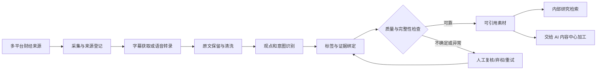

# 财经媒体数据抓取雷达：产品蓝图

> 版本：1.0  
> 记录日期：2026-09-24  
> 状态：产品方向与边界记录；后续建设顺序是建议，不等同于已批准的开发计划。

## 1. 产品定位

财经媒体数据抓取雷达是公司内部使用的财经内容数据采集、清洗、识别和证据整理工具。它面向直播、短视频和长视频等来源，将多平台、非结构化内容加工成研究人员能够复核、检索、引用并交给 AI 内容中心继续加工的素材。

雷达的核心产物不是一段脱离来源的摘要，而是带有来源、原文、时间定位、标签、处理状态和核验状态的内容素材。系统可以用大模型辅助清洗和识别，但模型输出不自动等于已核实结论。

## 2. 产品矩阵中的位置

| 产品 | 主要职责 | 向矩阵提供的内容 |
|---|---|---|
| A 股量化数据分析平台 | 复盘、统计分析、资金与盘面研究，以及量化系统和因子的研发分析 | 市场分析结论、研究过程和量化方法素材 |
| 财经媒体数据抓取雷达 | 采集财经媒体内容，完成转录、清洗、观点识别、标签和证据整理 | 来自主播、博主、研究者等媒体来源的可复核素材 |
| AI 内容中心 | 加工选题，将研究材料转成自媒体文章或视频并分发到媒体渠道 | 选题、文章、视频和发布结果 |

三者协作时，量化平台和雷达提供不同来源的研究素材，AI 内容中心负责选题加工和发布。雷达不负责最终选题判断、文章或视频创作，也不负责对外发布；量化平台的分析结论与媒体观点应保留各自来源和语义，不能混为同一类证据。

## 3. 使用者与首要目标

- 使用者：公司内部研究、内容研究和审核人员。
- 近期目标：在三个月建设周期内，优先向 AI 内容中心提供准确、有出处、可加工的财经素材。
- 优先原则：准确性高于处理速度；必要时放慢处理、保留待审核状态或放弃自动判断。
- 主要难点：数据源多、数据量大、非结构化内容类型多，清洗和标签识别复杂，目前主要依靠大模型处理。
- 当前范围：先把财经领域做准。未来可把采集、清洗、证据和任务治理能力扩展到其他行业，再为每个行业建立独立标签定义和验收数据。

## 4. 用户描述的现有能力

本节记录产品方对当前系统能力的描述；它不代表对线上运行质量或准确率的独立验收。

- 已支持财经直播间监控、转录字幕中的观点统计和主播意图/观点识别。
- 已支持抖音、B 站和 YouTube 的部分短视频、长视频采集与关键内容识别。
- 已围绕财经场景建设提示词 Agent、语音识别处理和内容标签能力。
- 当前产品链路已针对财经直播、短视频和长视频跑通；仍需通过真实人工基准确认其准确性和稳定性。

仓库中已落地的采集、转录、观点处理和评测能力，以现有 PRD、执行计划和代码为准；产品描述与部署事实不一致时，应以现场核验结果更新本蓝图。

## 5. 目标处理链路

每个环节都应保留输入和输出之间的关联。清洗文本不能覆盖原始转录；观点需要能回到原文片段和音视频时间位置；处理中断或识别失败不能伪装成“没有观点”。

## 6. 关键产品原则

1. **来源可追溯**：每份素材保留平台、账号或作者、内容链接、采集时间、转录及处理版本。
2. **原文优先**：保留原始字幕或转录，与清洗后的文本分开；重点检查数字、单位、专名、否定词、条件、期限和说话人归属。
3. **观点与事实分开**：识别“某人说了什么”不等于验证其说法属实；外部事实核验状态单独表达。
4. **标签带上下文**：对象、方向、期限、条件、引用对象和说话人等关键限定不能在归纳时丢失。未提及、无法判断和不适用应分别表示。
5. **不确定时不强行放行**：证据不足、归属不清、模型结果冲突或处理不完整时，允许待审、弃权或失败。
6. **人工纠错形成闭环**：修改记录进入错误分类和评测材料；已交付素材发生更正时，下游能够识别版本变化。
7. **准确率由数据证明**：结构正确、模型自报置信度或样本数量都不能单独证明语义准确。
8. **先财经后跨行业**：先验证财经标签和人工审核机制，再复用通用流程拓展行业，避免提前建设一棵臆定的通用标签树。

## 7. 功能建设蓝图

| 阶段 | 能力 | 目标结果 | 状态 |
|---|---|---|---|
| 基础已完成 | 冻结样本、人工裁决、质量指标与版本化报告工具 | 能重复评测，明确区分工具运行完成与质量验收通过 | 工具已实现；真实业务质量尚未验收 |
| 第一优先 | 人工标注和复核流程 | 审核者能查看上下文、定位原音视频、修正标签并记录审核人和版本 | 待建设/按实际系统复核 |
| 第一优先 | 真实验收基准 | 建立覆盖直播、短视频、长视频及真实难例的开发集和独立验收集 | 待业务采集与人工标注 |
| 第一优先 | 清洗与语义错误治理 | 根据基准暴露的问题改进转录、说话人归属、数字、条件、期限、实体和观点支持关系 | 按错误证据逐步建设 |
| 第二阶段 | 证据资产保留与更正通知 | 下游引用素材可长期回看，原内容变化或更正能够被发现 | 待建设 |
| 第二阶段 | 内容中心素材交付与采用反馈 | 交付含原话、归纳、标签、证据、状态和版本的素材，并接收采用、退回及原因 | 待完善 |
| 后续扩展 | 跨来源去重与事件归并 | 区分转载、切片和独立来源，不把重复传播误算为多份独立证据 | 按业务需要建设 |
| 后续扩展 | 跨行业标签配置 | 为新行业建立独立标签规范、样本和质量门槛 | 财经质量稳定后再评估 |

### 近期三个月建议节奏

- **第一个月：建立可信标尺。** 选定高频财经素材范围，完成标签定义、真实人工标注和证据留存规则。
- **第二个月：按错误修链路。** 依据人工基准中的错误，改进清洗、说话人归属、条件/期限保留、语义核验和人工复核。
- **第三个月：验证素材交付。** 将可回看、可引用的素材交给 AI 内容中心试用，记录采用、退回、更正及原因。

这个节奏是建设建议。阶段完成与否应由质量和业务使用结果判断，不按日历自动放行。

## 8. 质量与交付验收

已归档的财经标签质量基线规定：正式验收需要至少 20 个真实素材、300 条人工观点、5 位人物、10 个主题，并覆盖直播、短视频和长视频；语义精确率门槛为 98%，同时检查证据缺失、首次结构通过率、方向、主题/实体准确率和观点召回率。具体门槛及资格规则见 [质量基线规范](openspec/specs/finance-label-quality-baseline/spec.md)。

这些数值是验收门槛，不是当前质量结论。当前两条样例属于 demo，没有满足正式人工标注和覆盖要求，不能据此声称真实准确率达标。

面向实际交付，还应持续观察：

- 被放行素材的字段正确率和原文支持率；
- 原文与音视频证据可回看率；
- 漏标、弃权和人工修改比例；
- 按来源类型、主题和难例分层的错误分布；
- 内容中心素材采用率、退回率和退回原因；
- 已引用素材的更正可达率。

缺少来源证据或关键标签仍待确认的内容，不应作为已确认素材自动交付。不得通过排除困难样本或把重复来源当成独立样本来美化结果。

## 9. 明确边界

- 不做自动交易或投资建议。
- 不绕过权限采集私域或付费内容，不自动破解验证码或接管账号。
- 不把摘要当作观点，也不把观点转述当作已核实事实。
- 不由雷达代替 AI 内容中心决定选题、撰写成稿或发布内容。
- 跨行业能力暂不作为当前财经质量建设的前置条件。

## 10. 关联资料

- 详细产品需求：[01_finance_opinion_radar_PRD.md](01_finance_opinion_radar_PRD.md)
- 执行计划：[02_finance_opinion_radar_execution_plan.md](02_finance_opinion_radar_execution_plan.md)
- 当前差距与建议：[findings.md](findings.md)
- 质量评测和人工标注说明：[tests/golden/README.md](tests/golden/README.md)
- 财经质量基线规范：[openspec/specs/finance-label-quality-baseline/spec.md](openspec/specs/finance-label-quality-baseline/spec.md)
