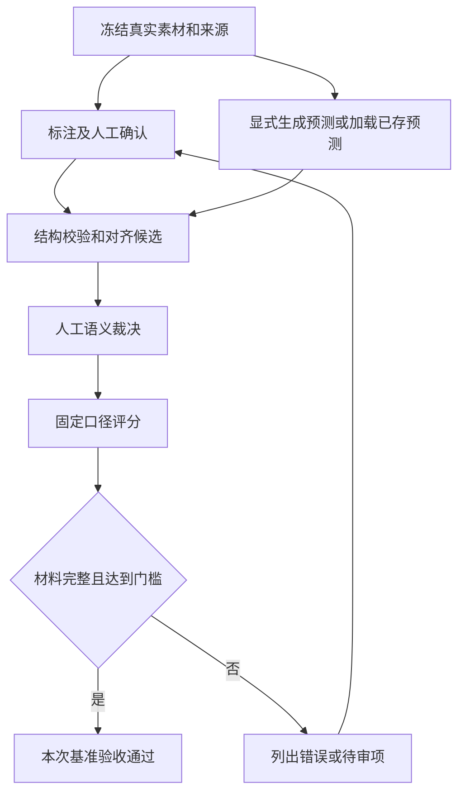

## Context

用户已确认内部使用、准确性优先，并以 AI 内容中心的可引用素材为近期目标。本批先交付衡量质量的规范、工具和待审材料，后续清洗、审核改进以实际错误为依据。

现有 `scripts/evaluate_viewpoints.py` 存在已核对边界：输入随数据库内容变化；固定使用 v1 prompt 且无库时只取前 50 段；按文字相似度匹配；方向准确率先筛掉方向不同的预测；无证据预测不进入证据分母；schema 成功按调用数累计但除以素材数；缺 baseline 时不启用阈值。现有两条 annotation 是待复核格式样例。

## Goals / Non-Goals

**Goals:**

- 建立可执行的财经观点标注手册、本地冻结样本协议及人工复核材料。
- 基于固定输入、固定预测和固定人工裁决重复评分；展示每个指标的分子、分母和适用范围。
- 明确工具可用、结构合格、语义待审、质量通过/失败四类结论，不把缺证据或失败记成通过。

**Non-Goals:**

- 本批不实现通用标注平台、线上人工审核界面、跨行业 schema 或新模型训练。
- 不修改生产抽取、共识、审核、留存、数据库和内容中心接口。
- 不自动把模型预标注签署为人工基准，不把字幕文本忠实度当作原始音视频核验或外部事实核查。
- 不新增测试代码或示例代码。

## Decisions

### 1. 扩展现有本地评测入口

继续使用 `scripts/evaluate_viewpoints.py` 与 `tests/golden/`。离线评分接收本地预测和人工裁决文件；只有显式选择生成预测才加载模型 provider。离线模式不初始化数据库连接、不调用外部模型。已有 CLI 参数尽量保留；默认运行在材料不完整时产生未验收报告并返回非零，显式演示模式仅表示流程完成。

候选方案：只改提示词无法知道质量是否改善；新建标注平台会扩大范围；先扩展现有评测入口可用最小改动建立事实基线。

### 2. 数据资格与来源按素材冻结

| 对象 | 最小内容 |
|---|---|
| 素材清单 | case_id、来源 URL、平台、原作者、直播/短视频/长视频类型、采集及原发布时间（未知显式空）、转录文件路径及内容哈希、数据集版本、开发/独立验收分组 |
| 标注资格 | demo / draft / human_verified；标注人、复核时间、原音视频核验状态；是否已完整标出本段材料中应抽的观点 |
| 人工观点 | reference_id、claim、对象/实体、方向、期限、条件标志与具体原话、讲话归属、证据段 ID；适用字段的未提及/不适用/无法判断状态 |
| 预测结果 | run_id、case_id、prediction_id、原始输出、处理成功/调用失败/结构失败状态，模型、提示词版本及哈希、全文/分块模式、输入哈希、实际覆盖范围；预先生成的逻辑处理单元清单、每次尝试的编号/结果和重试上限 |
| 人工裁决 | 对应的运行/输入/标注哈希，预测与 reference 的一对一关系，原文支持判定 pending/pass/fail、错误原因、审核人和时间 |

不预建跨行业标签树。内容类型（观点、预测、转述、事实性陈述、方法等）先作为标注说明与人工元数据；当前模型尚不输出的字段必须显示未评估，不能虚报该字段能力。已有金融方向枚举保持兼容。

现有两条样例归类 demo。可从真实本地材料生成 draft，且保留来源证据；缺原始材料或人工确认时留在待办。人工基准未建齐不阻止工具完成，但阻止正式质量通过。

### 3. 预测生成与评分分开

冻结转录是唯一评测输入，不再按 external_item_id 模糊查询数据库后切换内容。显式模型运行复用生产的现有全文/v1 分块规则和提示词包，记录实际使用版本、策略阈值、完整输入范围与原始输出，不执行生产落库服务。不得默默截前 50 段；超限或缺片段应标记失败/部分完成。

离线重评分使用已保存预测；重跑模型属于新 run，不覆盖旧结果。旧报告缺输入、模型或评测口径版本时，只能查看，不参与直接优劣比较。不同模型可比较，但数据、裁决规则和评分版本必须一致。

全文处理记作一个逻辑单元，分块处理每块记作一个逻辑单元；开始调用前保存完整计划，未调用的单元也保留。评测层每单元最多发起 3 次尝试，按顺序保存成功、模型/传输错误和结构错误，取最后一次有效成功输出用于语义评测。重试参数写入运行记录；所有尝试耗尽仍未成功才算该单元不完整，阻止正式通过。首次失败后成功不会抹去首次失败记录，也不能通过无限重试提高统计结果。

### 4. 结构检查与人工语义裁决分开

确定性校验负责文件、哈希、ID、枚举、时间、证据段归属、摘录一致性、一对一约束及计算。文字相似只用于提出对齐候选；正式匹配须由人工确认，不能要求方向/期限/实体相同才匹配。人工作为该批语义裁决者，不新增多模型投票。

原文支持判定检查：是否确有该观点、说话人/转述归属、对象、否定、方向、期限和条件。方向等标签错误保留在已对齐对中计错；多报、重复报分别计为错误预测。遗漏观点计漏抽。难例保持 pending 并展示审核覆盖率，不能静默排除。

### 5. 明确指标与门槛

| 指标 | 分子 / 分母及边界 |
|---|---|
| 运行覆盖 | 成功素材数 / 请求的全部素材数；失败、部分完成独立计数 |
| 结构通过率（首次尝试） | 首次尝试完整通过 schema 的逻辑单元数 / 预先计划的全部逻辑单元数；首次失败、漏调用计不通过，重试成功不改首次结果，报告不得超过 100% |
| 证据缺失率 | 无证据、证据越界或无法定位的预测观点数 / 全部预测观点数；不等同语义正确率 |
| 语义审核覆盖率 | 完成 pass/fail 裁决的预测数 / 全部预测数；零预测显示不适用 |
| 语义精确率 | 原文支持且无重复的正确预测数 / 全部预测数；存在 pending 时仅显示已审部分的阶段性统计，不发布正式精确率 |
| 观点召回率 | 经人工对齐且表达正确的金标准观点数 / 完整标注素材中全部应抽观点数；失败素材应抽观点仍留在分母 |
| 字段准确率 | 对齐观点中正确字段数 / 金标准已标注且适用的字段数；预测漏填或错误算错，方向相反不能从分母消失 |

对象/主题分别计算，实体集按同一对齐观点的一致集合评判，不用“全篇命中任意一个名字”算正确。全部指标记录计数、适用范围和按来源类型的分组结果。零分母为不适用；必需指标不可用不得正式通过。

首轮正式基准要求至少 20 个素材、300 条人工观点、5 位人物、10 个主题，直播/短视频/长视频均有覆盖；调试用素材与独立验收素材按来源组隔离，重发/切片不跨组。最低覆盖要求应用于正式验收分组，不用调试样本凑数。

正式验收门槛沿用 PRD：证据缺失率 0、首次尝试结构通过率至少 99%、明确方向准确率至少 90%、主题及实体准确率各至少 95%、观点召回率至少 85%。本提案建议新增语义精确率至少 98%，用于回应用户准确性优先目标；该值是待本提案确认的首轮业务门槛，不是当前测量值或总体准确性的保证。正式通过还要求全部请求素材最终处理完整、语义裁决全部完成、所需指标可计算。允许首次结构失败的单元经有限重试恢复后参与验收，首次失败仍计入 99% 指标；重试耗尽未恢复的单元因处理不完整阻止通过。baseline 仅用于兼容版本的回归比较，不控制是否启用这些门槛。

### 6. 状态、版本和报告

- 判定按以下顺序执行，并始终列出全部阻碍原因：①输入损坏、哈希冲突、裁决结构非法或评测器无法继续运行，`not_evaluated` + 退出码 3；②任何逻辑单元重试耗尽后仍失败或未执行，`failed` + 退出码 1，即使同时存在人审不足也以本项为主状态；③显式演示模式流程完整，`not_evaluated` + 退出码 0；④正式模式人工资格/覆盖不足、裁决未完或必需指标不可用，`not_evaluated` + 退出码 2；⑤完整正式验收未达指标门槛，`failed` + 退出码 1；⑥全部通过，`passed` + 退出码 0。
- 单条模型调用错误是可计数的处理结果，按第二项判断最终是否恢复；整体评测器崩溃/非法输入按第一项处理。首次结构失败后重试恢复，不直接强制 failed，而由首次结构通过率及其他门槛综合判断。所有模式均在报告中写明 mode，不将进程成功等同质量成功。
- 输出 JSON 和 Markdown，包含 run/dataset/输入/评分口径版本、配置阈值、计数、失败原因、缺口、逐条差异和待审清单。任何预测/转录/标注变动都会使关联裁决失效，须重新审核；记录不含凭据或环境秘密。

建议流程（目标行为，尚未实施）：

## Risks / Trade-offs

- 人工审核需要内部研究人员投入 → 工具先交付可定位的待审清单，保持 draft，绝不伪造签署。
- 转录本身可能有错 → 单列原音视频核验状态；未核验只声称忠于冻结文本。
- 评测生成与生产路径可能逐渐偏离 → 记录策略、版本、输入覆盖和处理边界；只有相同路径下的结果可支持对应抽取能力，不能泛化为整个线上系统质量。
- 初期正式验收会因样本不足显示未验收 → 明确这是当前证据状态，演示流程和工具验收可以完成。
- 98% 提案门槛可能需要较多人工复核 → 用首轮真实结果定位错误，不通过放宽口径或剔除困难样本获得通过。

## Migration Plan

1. 用户确认本提案后，在现有本地评测入口逐项实施；开始实现前按项目要求用 executing-plans 记录 `///` 步骤。
2. 旧样例标记 demo，旧报告保留，不赋予新口径下的质量结论；新增基准/运行目录前确认路径。
3. 用真实现有材料与明确标记的临时输入扰动验证失败、缺证据、方向不一致、重复和 pending 等场景；不新增测试代码，不把扰动材料纳入正式基准。
4. 同步 README、标注手册、任务状态和已知样本缺口。工具合同实现并验证后 archive；若人工质量验收尚未完成，作为明确后续工作保留，不冒充已经完成。
5. 仅本地脚本和数据格式变更，无生产发布或数据库迁移；回退实施提交可恢复旧工具，历史输出保持只读。

## Open Questions

- 提案确认时一并确认新增语义精确率 98% 的建议门槛；原 PRD 门槛在本批不自行降低。
- 内部人工复核人员及可投入时间尚未指定，后续导入可填；没有真实签署时正式基准维持待审，不阻碍先实现工具。
