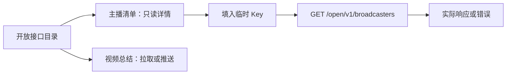

## Context

`OpenApiPage` 固定一个视频总结目录项；后端主播清单已存在。用户明确确认补入独立只读服务。

## Goals / Non-Goals

目标：目录可发现、契约准确、实际试读。非目标：新增 API、动态服务注册、推送主播清单、部署或无关重构。

## Decisions

在已有页面增加服务选择状态。主播清单使用独立仅拉取详情；复用同源 fetch、临时 Key 和响应展示，按所选服务选择 URL。切换时清空试读结果并禁止运行中切换，避免旧响应展示到新服务。视频总结默认视图与其所有既有控制保持不变。相比只加说明链接，独立目录满足已确认目标；无需引入动态注册表。

## Risks / Trade-offs

- [Key 泄漏] → 只在内存和请求头保留，不写 URL 或存储。
- [服务切换使结果混淆] → 清空结果，请求过程中禁止服务切换。
- [代码已改但运行网页仍旧] → 明确构建完成不表示已部署。

## Flow

